pgpolybool
==========

# Summary

Polygon arithmatic operations for native PostgreSQL POLYGON type.

pgpolybool provides the following functions for polygon boolean operations:

* POLYGON fn_union_polygons( POLYGON[] ): UNION 2..n polygons.
* POLYGON fn_union_polygons( POLYGON, POLYGON ): UNION two polygons.
* POLYGON fn_intersect_polygons( POLYGON[] ): INTERSECT 2..n polygons.
* POLYGON fn_intersect_polygons( POLYGON, POLYGON ): INTERSECT two polygons.
* POLYGON fn_subtract_polygons( POLYGON[] ): Subtract 2..n polygons.
* POLYGON fn_subtract_polygons( POLYGON, POLYGON ): Subtract two polygons.
* POLYGON fn_xor_polygons( POLYGON[] ): XOR 2..n polygons.
* POLYGON fn_xor_polygons( POLYGON, POLYGON ): XOR two polygons.

pgpolybool also provides the following utility functions:

* POLYGON fn_rotate_polygon( POLYGON, DOUBLE PRECISION ): Rotate a polygon by the specified number of radians
* POINT[] fn_get_polygon_points( POLYGON ): Return the points that comprise a given polygon
* LSEG[] fn_get_polygon_line_segments( POLYGON ): Return the line segments that comprise a given polygon
* BOOLEAN fn_line_segments_intersect( LSEG, LSEG ): Return whether or not two line segments intersect
* POINT fn_line_segments_intersection_point( LSEG, LSEG ): Return the point of intersection between two line segments, NULL if there is no intersection
* DOUBLE PRECISION fn_line_segments_distance( LSEG, LSEG ): Return the minimum distance between two line segments.
* DOUBLE PRECISION fn_get_polygon_line_segment_distance( POLYGON, LSEG ): Get the minimum distance between a polygon and a line segment.
* LSEG fn_get_orthogonal_segment( LSEG, POINT, DOUBLE PRECISION ): Generate an orthogonal line segment starting at the center of the provided line segment, pointing away from the optional POINT, and of length DOUBLE PRECISION (default length is unit length, or 1.0)

pgpolybool implements the clipping algorithm described in Martinez, Rueda, and Feito paper published the Computers & Geosciences Journal, Volume 35, issue 8 (pp. 1177-1185) ( see https://www.sciencedirect.com/science/article/pii/S0098300408002793 ).

The UNION operation scales the input polygons in order to increase the odds that intersections between the subject and clipping polygons are found. Once the operation has been completed, the polygons are scaled back to (an approximation of) their original size.

The work of Martinez et al was originally released into the Public Domain. This author requests that, in the spirit of the original authors, any derivative works be released under a permissive FOSS license or into the public domain as well.

# Details

A little more detail on the functions that are not self-explanatory

### Polygon UNION

As mentioned previously, this operation takes several steps during its computation:

* Order all input polygons by distance, ascending, from an arbitrary polygon in the set
* Scale all polygons to 104% of their current size (extends points away from the center of each input polygon)
* Perform the polygon union, pairwise, until every polygon in the input set has been unioned
* Scale the output polygon by contracting points back towards their original input polygon's center point. If new points were created during the union computation (read: intersections of line segments), these points are scaled to whichever input centroid they lie closest to.

### fn_get_orthogonal_segment

This generates an orthogonal segment (a perpendicular line segment) to the input line segment. This segment will have one end point at the center of the input line segment.

For any line segment, there are two orthogonal segments. The function (currently) selects whichever segment is in the positive (x,y) direction as its return value. If a POINT is provided as input, the segment with an endpoint furthest away from that point is returned instead.

The third argument ( length DOUBLE_PRECISION ), controls the scaling of the output line segment. The default length is 1.0

This function will return NULL in the case that there is no solution to the quadratic equation below:

Let the input line segment be defined as 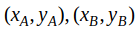
Let 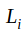 be the desired length of the output line segment, 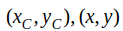

We must solve for 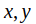 using the following system of equations:

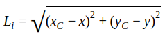

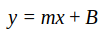

Where 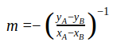 and 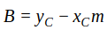

After some simplification, we arrive at the quadratic system of equations:

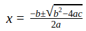

Where:

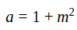

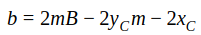

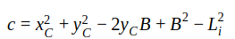

Provided that 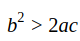 is satisfied, there exists real roots and a solution for 

# Installation

* Checkout the repo 'git clone <repo>'
* Build the repo 'make'
* Install with 'make install'
* Add the extension to your desired database 'CREATE EXTENSION pgpolybool;'

# Acknowledgements

Francisco Martinez, Antonio Reuda, and Francisco Feito for developing this algorithm, it is extremely versatile and fast. It excelled in cases where both the Vatti algorithm or Greiner-Hormann failed or could not be easily modified to handle collinearity edge cases. The authors also released their original work to the public domain.

Sean Connelly for his work at (http://sean.cm/a/polygon-clipping-pt2). This post contains a very well illustrated and articulated walkthrough of the algorithm's operation. There is also a interactive tool for playing around with polygon inputs to the algorithm.

PostgreSQL Global Development Group, for their finely maintained project, exceptional documentation, and enthusiastic user base.

Richard Davies for encouragements, jokes, insights and tricks in C/C++.

My employer, Nead Werx, Inc., for granting me the time to bring this implementation to PostgreSQL. I hope later to get this into the PostGIS codebase ;)

# Coming Soon

I seek to add the following features in future releases:

* SRF (set returning function) versions of the functions
* Arrive at state where op enhancements can be added to PostgreSQL core
* Arrive at state where polybool ops can be added to PostGIS
